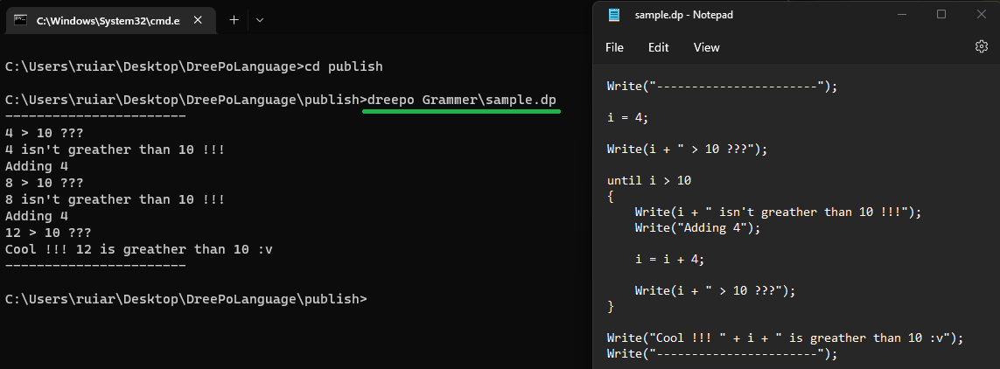

[![Contributors][contributors-shield]][contributors-url]
[![Forks][forks-shield]][forks-url]
[![Stargazers][stars-shield]][stars-url]
[![Issues][issues-shield]][issues-url]
[![MIT License][license-shield]][license-url]


<!-- PROJECT LOGO -->
<br />
<p align="center">
  <a href="https://github.com/ruigomes99/DreePoLanguage">
    
  </a>

  <h3 align="center">Now Even a Noob Can Program</h3>
</p>


<!-- TABLE OF CONTENTS -->
<details open="open">
  <summary>Table of Contents</summary>
  <ol>
    <li><a href="#dependencies">Dependencies</a></li>
    <li><a href="#usage">Usage</a></li>
    <li><a href="#dreepo-sample">DreePo Sample</a></li>
    <li><a href="#proof-of-concept">Proof of Concept</a></li>
    <li><a href="#license">License</a></li>
    <li><a href="#contact">Contact</a></li>
  </ol>
</details>


## Dependencies
- dotnet6
- ANTLR4


## Usage
Go to the publish folder and execute the file in your terminal as the following example.
NOTE: You need to give a path to a DreePo file as an argument !!!
```shell
cd publish
DreePo.exe Grammer\sample.dp
```

## DreePo Sample

```shell
Write("-----------------------");

i = 4;

Write(i + " > 10 ???");

until i > 10
{
    Write(i + " isn't greather than 10 !!!");
    Write("Adding 4");

    i = i + 4;

    Write(i + " > 10 ???");
}

Write("Cool !!! " + i + " is greather than 10 :v");
Write("-----------------------");
```


## Proof of Concept
<p align="center">
  <a href="https://github.com/ruigomes99/DreePoLanguage">
    
  </a>
</p>


## License

Distributed under the MIT License. See [MIT LICENSE](https://choosealicense.com/licenses/mit/) for more information.


## Contact

Rui Gomes -  [GitHub](https://github.com/ruigomes99) - ruigomes-99@hotmail.com
<br />Project Link: [https://github.com/ruigomes99/DreePoLanguage](https://github.com/ruigomes99/DreePoLanguage)


<!-- MARKDOWN LINKS & IMAGES -->
<!-- https://www.markdownguide.org/basic-syntax/#reference-style-links -->
[contributors-shield]: https://img.shields.io/github/contributors/ruigomes99/DreePoLanguage.svg?style=for-the-badge
[contributors-url]: https://github.com/ruigomes99/DreePoLanguage/graphs/contributors
[forks-shield]: https://img.shields.io/github/forks/ruigomes99/DreePoLanguage.svg?style=for-the-badge
[forks-url]: https://github.com/ruigomes99/DreePoLanguage/network/members
[stars-shield]: https://img.shields.io/github/stars/ruigomes99/DreePoLanguage.svg?style=for-the-badge
[stars-url]: https://github.com/ruigomes99/DreePoLanguage/stargazers
[issues-shield]: https://img.shields.io/github/issues/ruigomes99/DreePoLanguage.svg?style=for-the-badge
[issues-url]: https://github.com/ruigomes99/DreePoLanguage/issues
[license-shield]: https://img.shields.io/github/license/ruigomes99/DreePoLanguage.svg?style=for-the-badge
[license-url]: https://github.com/ruigomes99/DreePoLanguage/blob/main/LICENSE
